


 


 


 


### 🚀 FEATURED MISSIONS

<table>
<tr>
<td width="50%">
<a href="https://github.com/AmnaaFarooq/MessageMate-AI">
</a>
</td>
<td width="50%">
<a href="https://github.com/AmnaaFarooq/book-recommender-system">
</a>
</td>
</tr>
<tr>
<td width="50%">
<a href="https://github.com/AmnaaFarooq/school-fee-management">
</a>
</td>
<td width="50%">
<a href="https://github.com/AmnaaFarooq/Handwritten-digit-recognizer-WebApp">
</a>
</td>
</tr>
</table>

 


 


 


 


 

